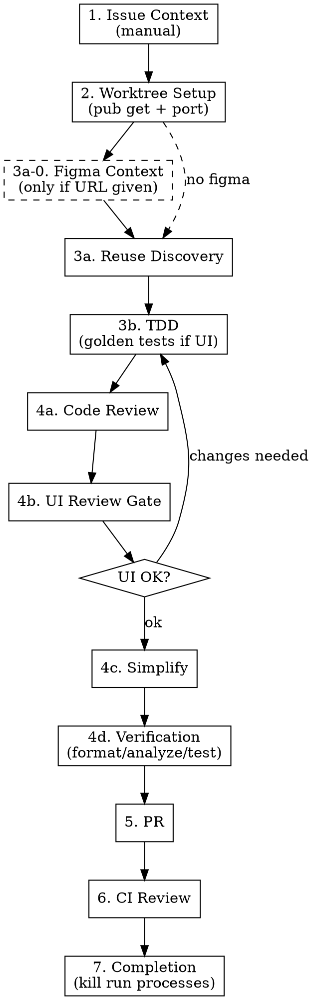

# Flutter Golden Cycle

A full Flutter development cycle that treats visual output as part of the test contract. Adapted from a private Flutter monorepo skill and generalized for public use.

## Foundational Principle

**Violating the letter of the rules is violating the spirit of the rules.**
UI quality gates (goldens, visual review, reuse discovery) are not optional polish — they are part of RED/GREEN. Skipping them means you are not doing TDD for UI.

## Requirements

- Flutter SDK ≥ `3.16.0` (Dart ≥ `3.2`).
- Plain `flutter` toolchain. `melos` is auto-detected and used when present but **not required**.
- Optional peer plugins (install separately for full capability):
  - `figma` — enables Phase 3a-0 design context capture.
  - Claude Code `superpowers` bundle — this skill inlines the git-worktree / TDD / verification / code-review patterns it needs, so superpowers is recommended for parity but not required.

## Before You Begin

Run `/flutter-golden-cycle-init` once per project to generate `.claude/flutter-golden-cycle.config.json` and install golden-test helpers. Then start the workflow below.

## Phase 0 — Load Configuration (implicit, runs before Phase 1)

Before any workflow phase executes, bind `config.*` from (in priority order):

1. `.claude/flutter-golden-cycle.config.json` in the project root.
2. Plugin-level `${user_config.*}` values set at install time.
3. Built-in defaults (see `assets/config.schema.json`).

If `.claude/flutter-golden-cycle.config.json` is missing entirely, halt and suggest `/flutter-golden-cycle-init`.

All subsequent `${config.uiPackage}`, `${config.defaultRunApp}`, etc. references below are resolved against these bound values — **not** against Claude Code template-expansion.

## Workflow



## Phase 1 — Issue Context (manual)

**Goal:** Have a structured issue object to anchor the rest of the workflow on.

**Actions:**

1. Ask the user for:
   - Issue identifier (free-form string; e.g. `PROJ-123`, `#42`, `login-redesign`)
   - One-line title
   - Description / acceptance criteria (multiline)
   - Optional Figma URL
2. Persist the structured object at `.claude/worktrees/<slug>/.issue-context.json` (created after Phase 2). Until then, keep in-memory.

<!-- Design notes (review before release):
     v0.2 adds Linear / GitHub adapters. The manual structure above is the
     canonical shape all adapters will produce, so tests and later phases
     should read from this object only — never from provider-specific fields. -->

## Phase 2 — Worktree Setup

**Goal:** Isolate work in a fresh worktree with a deterministic web port.

**Actions:**

1. **Branch name:** `feature/<identifier-lowercased>-<title-slug>` (slug: lowercase, non-alnum → hyphens, max 50 chars).
2. **Create the worktree:**
   ```sh
   git worktree add -b <branch-name> .claude/worktrees/<branch-name>
   cd .claude/worktrees/<branch-name>
   ```
3. **Install dependencies:**
   - If `melos.yaml` exists: `melos bootstrap`
   - Else: `flutter pub get` (recursively for nested packages if any)
4. **Allocate deterministic web port:**
   ```sh
   bash "${CLAUDE_PLUGIN_ROOT}/scripts/worktree-port.sh" <branch-name> > .web-port
   PORT=$(cat .web-port)
   ```
5. **Port-already-in-use check:**
   ```sh
   if lsof -i :"$PORT" >/dev/null 2>&1 || \
      (command -v netstat >/dev/null 2>&1 && netstat -an | grep -q ":$PORT .*LISTEN"); then
     echo "Port $PORT already in use. Another worktree may be hashing to the same slot."
     echo "Rename this branch or run /flutter-golden-cycle-cleanup to free ports."
     exit 1
   fi
   ```
6. **Baseline sanity:** `flutter analyze` (from project root or ui package). Failures → report to user and ask whether to proceed or abort.

## Phase 3a-0 — Figma Context (conditional)

**Trigger:** A `figma.com/design/...`, `figma.com/make/...`, or `figma.com/board/...` URL appears in the issue context or is given during this cycle. If no Figma link, skip this phase.

**Actions:**

1. **Resolve Figma MCP tool names at runtime** — tool names vary by how the user installed the Figma plugin. Use `ToolSearch`:
   ```
   ToolSearch("figma screenshot")       → tool for get_screenshot
   ToolSearch("figma design context")   → tool for get_design_context
   ToolSearch("figma variable defs")    → tool for get_variable_defs
   ```
2. **If any tool is unresolved:** inform the user —
   > *"Figma MCP plugin not found. Install it (e.g. `/plugin install figma`) to enable design-context capture, or provide no Figma URL to skip this phase. Continuing without Figma context."*

   Then skip Phase 3a-0 and proceed to Phase 3a.
3. **If resolved:** call the three tools and persist artifacts:

   | File | Source | Later consumer |
   |---|---|---|
   | `.figma-refs/screenshot.png` | `get_screenshot` | Phase 4b AI visual check |
   | `.figma-refs/design-context.json` | `get_design_context` | Phase 3a, 3b |
   | `.figma-refs/tokens.json` | `get_variable_defs` | Phase 4a drift check |
   | `.figma-refs/node-url.txt` | trigger URL | PR body |

**Hard rules:**
- Do **not** generate Flutter code from these artifacts here. They are the intent spec; implementation goes through Phase 3a reuse discovery.
- 1:1 visual fidelity ≠ 1:1 code duplication.

## Phase 3a — Reuse Discovery (UI work only)

**Goal:** Avoid reinventing widgets that already exist.

**Order (first hit that covers the design wins):**

1. **Existing widgets in `${config.uiPackage}`** — grep that package's `lib/` for intent keywords. Read matching files.
2. **Material 3 baseline** — `FilledButton`, `Card`, `ListTile`, `NavigationBar`, `RadioListTile`, etc., styled via `ThemeData` or widget-level params. **Prefer this over hand-rolled `Container`+`GestureDetector`.**
3. **New custom widget** — only if 1–2 cannot express the design. **You must record the justification** ("Material 3 lacks X because …") in the PR body.

Treat this as the RED for design: state *"here is what exists and why it is insufficient"* before adding code.

## Phase 3b — TDD Implementation

**Classify the change first:**

| Change location | Test type |
|---|---|
| `${config.uiPackage}/lib/**` widgets | **golden test required** + unit test |
| App-layer screens / sheets / dialogs | golden test recommended (≥ 2 variants) |
| Pure logic / data / providers | unit test only, no goldens |

### RED → GREEN → REFACTOR (inlined)

1. **RED:** Write the test (unit and/or golden). Run it. **See it fail.** A test that passes on first run was not testing what you think.
2. **GREEN:** Write the minimum code to pass. Run. Passing.
3. **REFACTOR:** Improve structure. Run again. Still passing.

Never skip the RED run.

### Golden tests — the language of visual intent

A golden test renders `widget + injected data + logic result` and snapshots the pixels. The snapshot IS the spec.

1. Place golden files under `${config.uiPackage}/test/goldens/<widget_name>/<variant>.png`.
2. Use the helpers installed by `/flutter-golden-cycle-init`:
   - `setUpGoldenFonts()` — once in `main()` before groups.
   - `useGoldenViewport(tester)` — before `pumpWidget`.
   - `goldenHost({child, width})` — MaterialApp wrapper with config-driven theme.
3. Tolerance is controlled by `flutter_test_config.dart` at the uiPackage root (default 2%). Don't edit per test.
4. **Variant matrix (minimum for stateful widgets):** `default` + at least one of `empty`, `loading`, `error`, `long-text`, `pressed`, `disabled`. Each variant must exercise a different code path — "same widget, different size" does not count.

**First-golden bootstrap:** new widget tests fail red because no baseline exists. Use `/flutter-golden-cycle-baseline <test-file>` — it runs `--update-goldens` inside `${config.uiPackage}`, previews the PNGs, and asks for your approval before committing.

### Commit discipline (Tidy First)

One concern per commit. Split:
- `test(ui): add <widget> goldens baseline` (adds PNGs, no production change)
- `refactor(ui): ...` (structural, no behaviour)
- `feat(ui): ...` or `fix(ui): ...` (behaviour)

Mixing golden baselines with feature code makes diffs unreviewable. Always split.

## Phase 4a — Code Review

Dispatch the `code-reviewer` agent (or superpowers `code-reviewer` if installed). The reviewer MUST check:

- **Reuse check** — did we skip an existing widget in `${config.uiPackage}` or a Material 3 baseline?
- **Accessibility** — `Semantics` coverage, 48×48 logical touch targets, sufficient color contrast.
- **i18n** — no hard-coded user-facing strings; use the project's localization mechanism.
- **Material 3 preference** — flag hand-rolled `Container` + `GestureDetector` combos.
- **Design-token drift** (only when `.figma-refs/tokens.json` exists):
  - Every color introduced in this PR must map to a named theme/role; raw hex literals (`#[0-9A-Fa-f]{6}` / `0xFF[0-9A-Fa-f]{6}`) are an **Important** issue.
  - Spacing values should use the project's spacing scale; magic `EdgeInsets.only(...)` values need justification.
  - Typography uses theme text styles, not inline `TextStyle(fontSize: ...)`.

Act by severity: Critical → fix now; Important → fix before Phase 4b; Minor → note.

## Phase 4b — UI Review Gate

Skip only if Phase 3b classification was "pure logic / no goldens". Otherwise:

### Step 1 — Launch

Decide the surface:

| Change set | Command |
|---|---|
| `${config.uiPackage}` only (no app wiring) | build the goldens only; no `flutter run` needed unless user explicitly wants to poke it |
| App-layer change | `cd ${config.defaultRunApp} && flutter run -d ${config.defaultRunDevice} --web-port=$(cat .web-port)` |

Launch with `Bash(run_in_background=true)`. Record:
- PID → `.flutter-run.pid`
- Log → `.flutter-run.log`

### Step 2 — Dual review

1. **User visual review** — share the URL or note the native window. Ask: *approve as-is / needs changes / need another look?*
2. **AI image review:**
   - **2a. Golden vs intent.** For each new/changed PNG under `${config.uiPackage}/test/goldens/**`, `Read` the file and describe it. Compare to the stated phase-3a/3b intent.
   - **2b. Figma source vs render.** Runs only when Phase 3a-0 captured artifacts. `Read` both `.figma-refs/screenshot.png` and the new golden. Run this checklist:

     | Dimension | Check |
     |---|---|
     | Colors | Primary surfaces visibly match. Name tokens when `tokens.json` exists. |
     | Spacing | Gap/padding ratios match; > ~4 px or > 1 scale step is a flag. |
     | Typography | Size hierarchy + weight + alignment match. |
     | Layout | Row/column/stack structure + wrapping behavior match. |
     | Assets | Icons/images present (not placeholders). |

     Report per row as ✅ or ⚠️ with a concrete what/where.

Both gates must pass.

### Step 3 — Loop

"Needs changes" → return to Phase 3b. Hard cap **3 loops** — after 3, escalate to the user with a summary instead of silently looping.

## Phase 4c — Simplify

Review changed code for reuse, quality, and efficiency. Keep structural-only; don't introduce behaviour changes that would invalidate goldens. If the `simplify` skill is installed, invoke it here.

## Phase 4d — Verification Gate

Run in order; each must succeed before the next:

```sh
# Format
dart format .

# Analyze
flutter analyze --fatal-infos

# Test (includes golden tests)
flutter test
```

If `melos` is present, use `melos format / melos analyze / melos test` instead (same semantics, aware of nested packages).

### Golden update dual gate

`flutter test --update-goldens` is **forbidden** unless BOTH are true:
- ✅ User visually approved the result in Phase 4b.
- ✅ You (the AI) read the new/diff PNGs with the `Read` tool and confirmed the visual change is intentional.

The `/flutter-golden-cycle-baseline` command wraps this dual gate — prefer it over invoking `--update-goldens` by hand. Commit updated PNGs as a separate `test(ui): update <widget> goldens — <why>` commit.

## Phase 5 — PR Creation

Use `gh pr create`. Body must include:

- Issue identifier (from Phase 1)
- Screenshots for UI changes
- Golden variants added/updated (names)
- If a new custom widget: the Phase 3a justification ("Material 3 lacks X because …")
- If Figma-driven: source node link + which existing widget or Material 3 baseline was chosen + key Figma variables mapped to theme tokens

## Phase 6 — CI Review Loop

Poll PR checks. If a `claude-code-review.yml` (or equivalent) is present, wait for its comments and address them. Max 5 fix cycles. Stop on 2 consecutive identical comments (stagnation) and escalate to the user.

## Phase 7 — Completion

1. Kill any launched app:
   ```sh
   [ -f .flutter-run.pid ] && kill "$(cat .flutter-run.pid)" 2>/dev/null || true
   rm -f .flutter-run.pid
   ```
2. Remove the worktree once merged:
   ```sh
   cd <project-root>
   git worktree remove .claude/worktrees/<branch-name>
   ```
3. Summary to user: issue, branch, PR URL, CI status, golden counts.

---

## Rationalizations — Stop and Reset

| Excuse | Reality |
|---|---|
| "Simple widget, golden is overkill" | Simple widgets regress silently. A golden is 10 lines. Ship the golden. |
| "Material 3 can't do this design" | State *specifically* what breaks. Can't name it → Material 3 is enough. |
| "Let me just run `--update-goldens`" | Unreviewed update = untested deploy. Use `/flutter-golden-cycle-baseline`. |
| "I'll eyeball the diff, no need to Read" | The `Read` tool reads PNGs. Use it. Your eyes and the AI's eyes catch different things. |
| "Only one worktree, port doesn't matter" | Parallel worktrees are the default mode. Assign the port in Phase 2. |
| "Tests pass so it's fine to skip Phase 4b" | Tests verify *code*. Phase 4b verifies *intent*. |
| "I'll mix the feature and golden in one commit" | Reviewers can't separate spec from code. Split. |
| "Figma output is close to our stack, I'll just paste it" | Figma output is a *spec*, not a commit. Run it through Phase 3a reuse first. |
| "The color is almost the same, I'll just inline the hex" | Next Figma token change = hunt across the codebase. Add to a theme role once, reference forever. |
| "Figma and render look close enough, skip 2b" | Close-enough is where drift lives. Run the checklist — 30 seconds per widget. |

<!-- TODO(user): add rationalizations from your own team's experience. The table
     above is a starter set drawn from the source skill; your own failure
     patterns will be more specific. -->

## Red Flags — STOP and Restart

- A UI-touching commit with no goldens added/updated.
- `flutter test --update-goldens` run without user approval AND AI PNG read.
- `feat(ui):` commit that also adds `test/goldens/**/*.png`.
- Phase 4 completed without `flutter run` actually launching (when required).
- New widget added without first grepping `${config.uiPackage}`.
- Web ports hard-coded instead of read from `.web-port`.
- Figma URL present but Figma MCP tool names not resolved via `ToolSearch`.
- Figma URL present but `.figma-refs/screenshot.png` wasn't captured.
- Generated Figma snippet pasted into `${config.uiPackage}` without Phase 3a passing.
- Hex color literal introduced in a Figma-driven change without first adding to a theme role.

All of the above mean: back up to the phase that was violated and redo it.

## Critical Assets (installed by `/flutter-golden-cycle-init`)

- `${config.uiPackage}/test/helpers/golden_host.dart` — `setUpGoldenFonts`, `useGoldenViewport`, `goldenHost`.
- `${config.uiPackage}/test/flutter_test_config.dart` — tolerance comparator.
- `${CLAUDE_PLUGIN_ROOT}/scripts/worktree-port.sh` — deterministic port allocator (invoked, not copied).

## Configuration Reference

Config is read from (in priority order):
1. `.claude/flutter-golden-cycle.config.json` in the project root (team-shared).
2. `userConfig` values set at plugin install time (substituted as `${user_config.KEY}`).
3. Built-in defaults.

See `docs/CONFIG.md` for the full schema.

## Out of Scope (v0.1)

- Linear / GitHub Issues automatic issue pulling (manual only for now).
- Widgetbook / catalog-based UI gate.
- Dark-mode / locale-variant golden matrices.
- iOS / Android simulator launch (web + macOS + linux covers the review need).
- Figma Code Connect — Flutter isn't an officially supported Code Connect target.
